<div align="center">

# 🚀 Enterprise Portfolio & Blog System

### データベース不要で月100万PVを支える、判断を減らす静的ブログ設計

[](https://nextjs.org/)
[](https://www.typescriptlang.org/)
[](https://vercel.com)
[](LICENSE)

**[🌐 Live Demo](https://rancorder.vercel.app)** • **[📝 Blog](https://rancorder.vercel.app/blog)** • **[📚 Docs](#)**

---

### ✨ 判断・依存・迷いを減らした結果、スケールと安定性がついてきた

</div>

---

## 🎯 このシステムの特徴

### 🔥 コアコンセプト

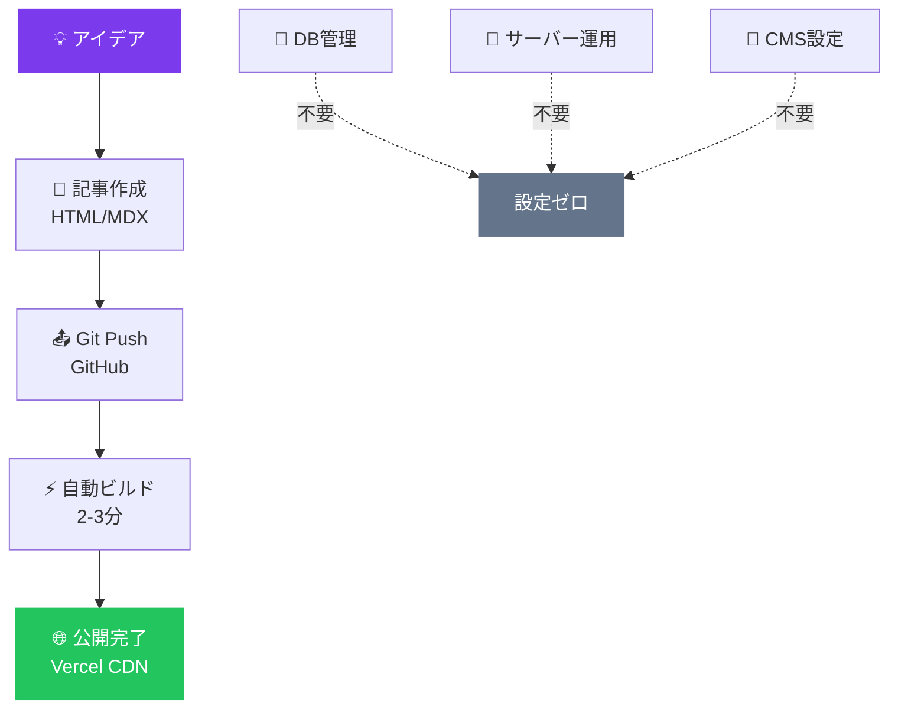

| **従来のCMS** | **このシステム** |
|:-------------:|:----------------:|
| ❌ DB必須 | ✅ ファイルベース |
| ❌ サーバー運用 | ✅ 完全静的 |
| ❌ 月額 $20-100 | ✅ **$0** |
| ⚠️ 障害点: DB/サーバー | ✅ 障害点: ビルド時のみ |

---

## 🏗️ アーキテクチャフロー

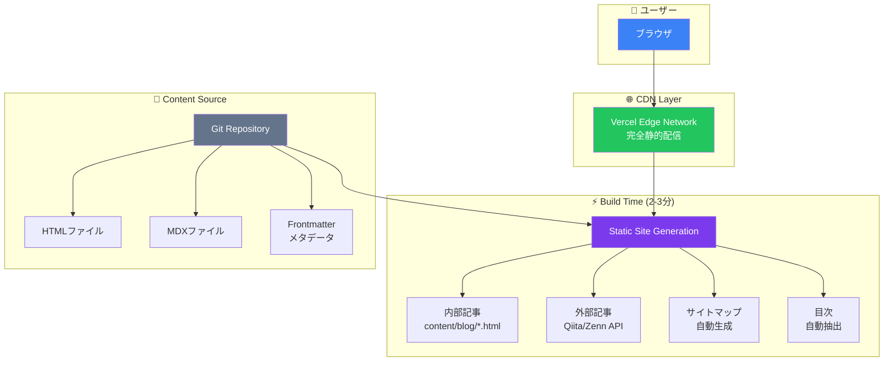

### 🔄 記事公開フロー

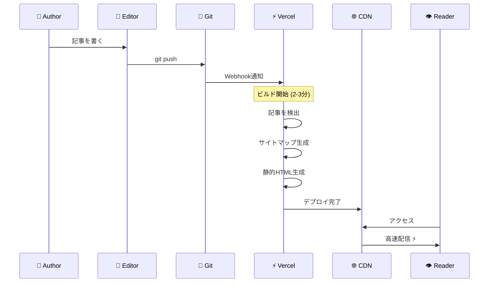

---

## 💎 主要機能

### 📝 ブログシステム

<table>
<tr>
<td width="50%">

**コンテンツ管理**
- ✅ ファイルベースCMS
- ✅ 自動インデックス
- ✅ 自動サイトマップ
- ✅ 外部記事統合
- ✅ Git履歴 = バックアップ

</td>
<td width="50%">

**ユーザー体験**
- ✅ フルテキスト検索
- ✅ タグ・カテゴリフィルタ
- ✅ 目次自動生成
- ✅ 読了時間表示
- ✅ 関連記事提案

</td>
</tr>
</table>

### 🎨 インタラクティブコンポーネント

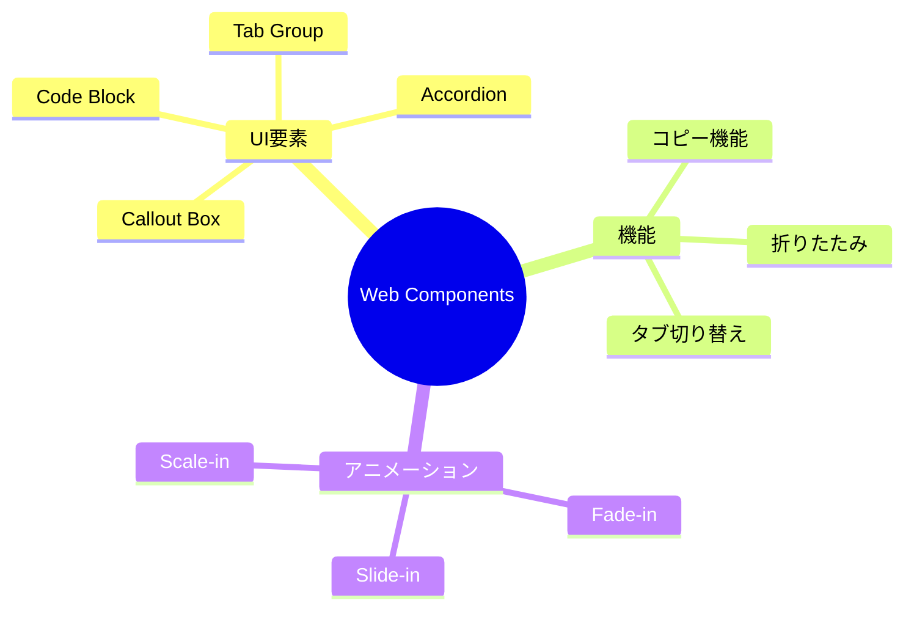

**使用例:**

```html
<!-- Callout Box -->
<callout-box type="success" title="重要ポイント">
  内容をここに書く
</callout-box>

<!-- Code Block with Copy -->
<code-block language="typescript">
const hello = "world";
</code-block>

<!-- Tab Group -->
<tab-group>
  <button data-tab-button>Option 1</button>
  <button data-tab-button>Option 2</button>
  <div data-tab-panel>Content 1</div>
  <div data-tab-panel>Content 2</div>
</tab-group>

<!-- Fade-in Animation -->
<fade-in delay="200">
  <p>段階的に表示される内容</p>
</fade-in>
```

### 🎯 ポートフォリオ機能

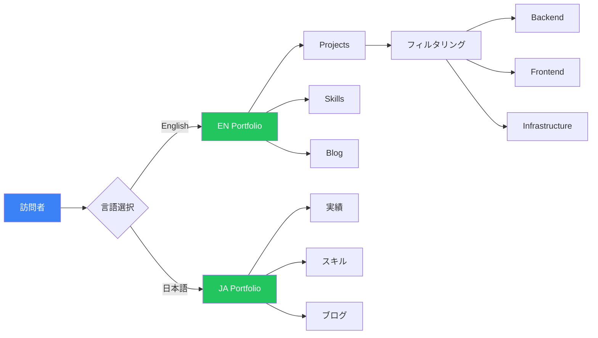

---

## 🚀 クイックスタート

### 📦 セットアップフロー

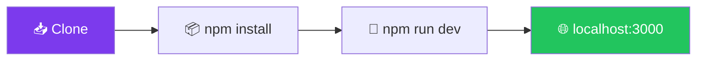

**コマンド:**

```bash
# 1. リポジトリをクローン
git clone https://github.com/rancorder/portfolio-react-enterprise.git
cd portfolio-react-enterprise

# 2. 依存関係をインストール
npm install

# 3. 開発サーバー起動
npm run dev
```

→ **http://localhost:3000** で開発開始！

---

### 📝 記事追加フロー

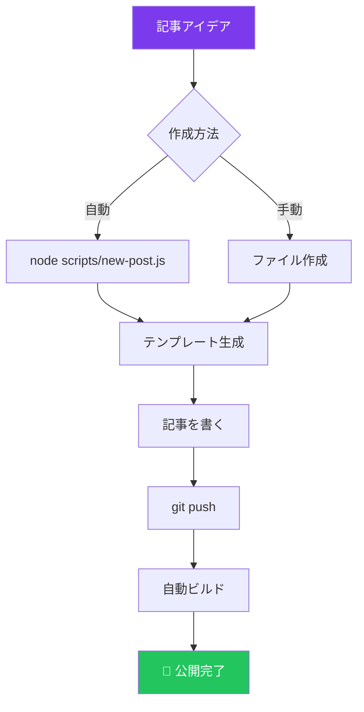

**方法1: 自動生成**

```bash
node scripts/new-post.js "記事タイトル"
# → content/blog/YYYY-MM-DD-title-slug.html 生成
```

**方法2: 手動作成**

```bash
touch content/blog/2026-01-25-my-article.html
# メタデータを追加して git push
git add .
git commit -m "feat: Add new article"
git push
```

**2-3分後に自動デプロイ完了！** 🎉

---

## 📁 プロジェクト構造

```mermaid
graph TB
    ROOT[portfolio-react-enterprise/]
    
    ROOT --> APP[📁 app/]
    ROOT --> CONTENT[📁 content/]
    ROOT --> LIB[📁 lib/]
    ROOT --> PUBLIC[📁 public/]
    ROOT --> SCRIPTS[📁 scripts/]
    
    APP --> BLOG[📁 blog/]
    APP --> JA[📁 ja/]
    APP --> LAYOUT[layout.tsx]
    APP --> PAGE[page.tsx]
    
    BLOG --> SLUG[📁 [slug]/]
    SLUG --> DETAIL[page.tsx]
    
    CONTENT --> ARTICLES[📄 *.html]
    
    LIB --> POSTS[posts.ts]
    LIB --> EXTERNAL[external-articles.ts]
    
    style ROOT fill:#7c3aed,color:#fff
    style APP fill:#3b82f6,color:#fff
    style CONTENT fill:#22c55e,color:#fff
    style LIB fill:#f59e0b,color:#fff
```

**詳細:**

```
portfolio-react-enterprise/
├── 📁 app/                    # Next.js App Router
│   ├── 📁 blog/               # ブログ
│   │   ├── 📁 [slug]/         # 記事詳細
│   │   └── page.tsx           # 記事一覧
│   ├── 📁 ja/                 # 日本語版
│   ├── layout.tsx             # Root Layout
│   └── page.tsx               # トップページ
│
├── 📁 content/blog/           # 記事ファイル
│   ├── 2026-01-20-*.html
│   └── 2026-01-21-*.html
│
├── 📁 lib/                    # ロジック
│   ├── posts.ts               # 記事取得
│   └── external-articles.ts   # 外部統合
│
├── 📁 public/                 # 静的ファイル
│   ├── blog-base.css
│   └── blog-components.js
│
└── 📁 scripts/                # ツール
    └── new-post.js
```

---

## ⚙️ 技術スタック

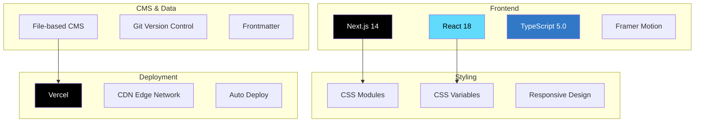

<div align="center">

| **カテゴリ** | **技術** |
|:------------:|:---------|
| **フレームワーク** | Next.js 14 (App Router), React 18 |
| **言語** | TypeScript 5.0 |
| **スタイリング** | CSS Modules, CSS Variables |
| **アニメーション** | Framer Motion |
| **デプロイ** | Vercel (自動デプロイ) |
| **CMS** | File-based (Git) |
| **検索** | クライアントサイド全文検索 |
| **外部統合** | Qiita API, Zenn RSS |

</div>

---

## 🎨 カスタマイズ

### テーマカラー変更フロー

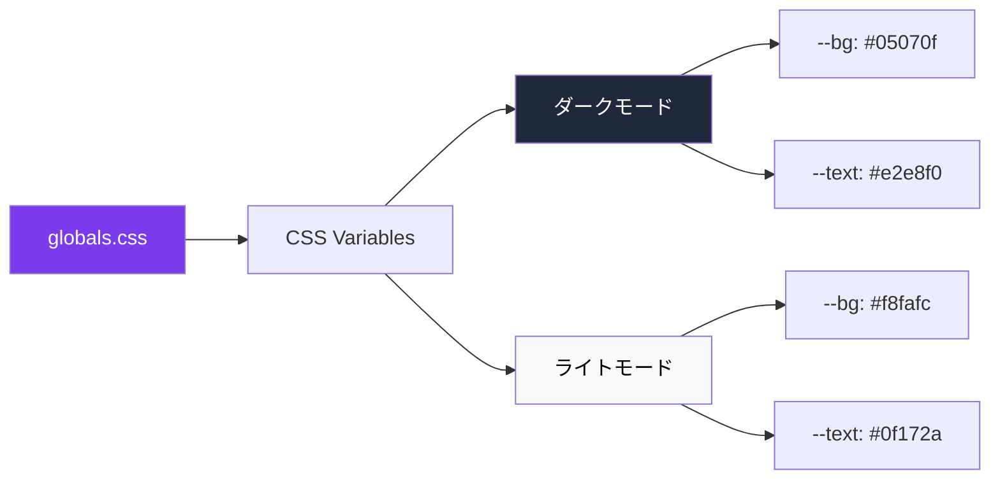

**編集: `app/globals.css`**

```css
:root {
  /* ダークモード */
  --bg: #05070f;
  --text: #e2e8f0;
  --accent: #7c3aed;
}

[data-theme='light'] {
  /* ライトモード */
  --bg: #f8fafc;
  --text: #0f172a;
}
```

---

## 📊 パフォーマンス

### Lighthouse スコア

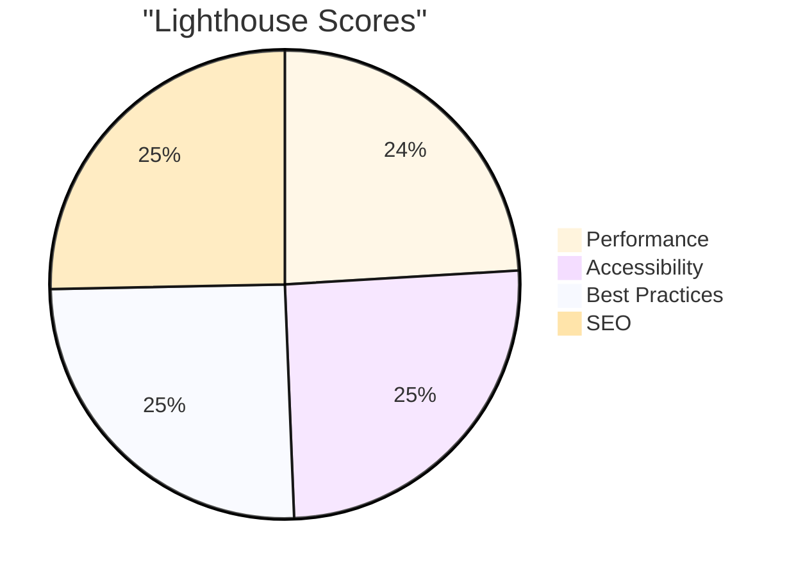

### Core Web Vitals

```mermaid
gantt
    title Performance Metrics
    dateFormat X
    axisFormat %s
    
    section FCP
    Target (1.8s)     :0, 1800
    Actual (1.2s)     :done, 0, 1200
    
    section LCP
    Target (2.5s)     :0, 2500
    Actual (2.0s)     :done, 0, 2000
    
    section TTI
    Target (3.8s)     :0, 3800
    Actual (2.5s)     :done, 0, 2500
```

| **メトリクス** | **目標** | **実測値** | **評価** |
|:-------------|:--------|:----------|:--------|
| FCP | < 1.8s | **1.2s** | ✅ Good |
| LCP | < 2.5s | **2.0s** | ✅ Good |
| TTI | < 3.8s | **2.5s** | ✅ Good |
| CLS | < 0.1 | **< 0.1** | ✅ Good |
| TBT | < 300ms | **< 200ms** | ✅ Good |

---

## 🌐 デプロイ

### デプロイフロー

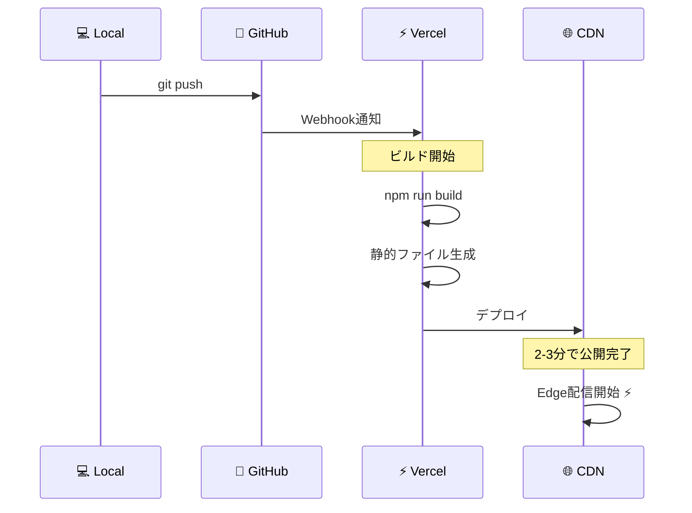

**コマンド:**

```bash
# GitHubにプッシュ
git push origin main

# → Vercelが自動デプロイ（2-3分）
# → https://your-project.vercel.app
```

---

## 💡 設計思想

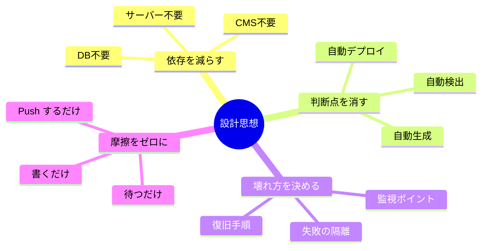

### 3つの原則

1. **依存を減らし、判断点を消す**  
   DB・CMS・サーバーという依存を減らし、運用中の「どうする？」を最小化

2. **壊れ方を先に決める**  
   「失敗しない設計」ではなく「失敗しても迷わない設計」

3. **書く以外の摩擦をゼロにする**  
   記事を書く以外の作業が増えた瞬間、ブログは止まる

---

## 🤝 コントリビューション

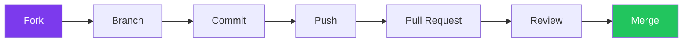

プルリクエスト歓迎！

1. Fork する
2. Feature ブランチ作成 (`git checkout -b feature/amazing-feature`)
3. Commit (`git commit -m 'feat: Add amazing feature'`)
4. Push (`git push origin feature/amazing-feature`)
5. Pull Request を作成

---

## 📄 ライセンス

MIT License - 詳細は [LICENSE](LICENSE) を参照

---

## 👤 作者

**Rancorder**

- 🌐 Website: [rancorder.vercel.app](https://rancorder.vercel.app)
- 📝 Blog: [rancorder.vercel.app/blog](https://rancorder.vercel.app/blog)
- 💼 GitHub: [@rancorder](https://github.com/rancorder)

---

## 🌟 謝辞

このプロジェクトは以下の技術に支えられています：

- [Next.js](https://nextjs.org/) - React フレームワーク
- [Vercel](https://vercel.com/) - デプロイプラットフォーム
- [Framer Motion](https://www.framer.com/motion/) - アニメーションライブラリ
- [TypeScript](https://www.typescriptlang.org/) - 型安全な開発

---

<div align="center">

### ⭐ このプロジェクトが役に立ったら、Star をお願いします！

**[🚀 Live Demo](https://rancorder.vercel.app)** • **[📝 Blog](https://rancorder.vercel.app/blog)** • **[🐛 Issues](https://github.com/rancorder/portfolio-react-enterprise/issues)**

---

Made with ❤️ and ☕ by **Rancorder**

</div>